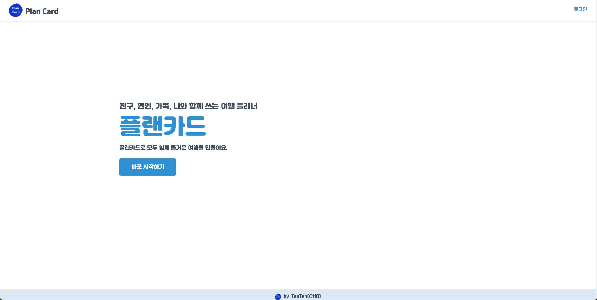
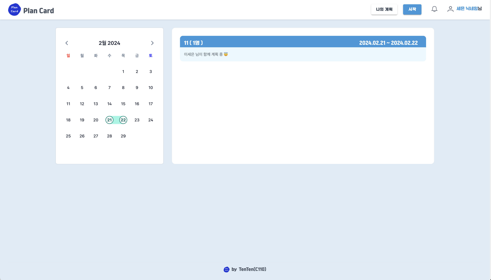
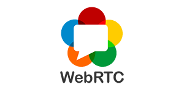
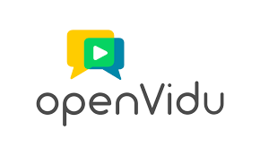
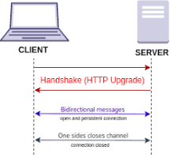

# 🛫플랜카드(PlanCard) 

## 🛫서비스 소개

플랜 카드는 여러명이 동시에 실시간으로 여행 계획을 생성할 수 있도록 하는 서비스입니다.
 
여행지 선택부터 일정 조율까지 모두가 한자리에서 동시작업으로 진행할 수 있습니다.

### 🎯타겟
  - 여행을 좋아하는 사람 
  - 함께 효율적으로 여행 계획을 세우고 싶은 사람
  - 여행을 계획하는 설렘을 동시에 공유하고 싶은 모두! 🥰

## 🛫기획배경

### 배경

여행을 계획할 때 지도와 전화 등 이용하는 서비스가 분산되어 있고 여행계획을 공유한다고 해도 이미 일정을 생성한 후에 사후 공유 방식이 대부분입니다.
 
자유로운 대화와 동시에 여행 계획을 편집하며 여행 가기전 설렘을 극대화하며 색다른 추억을 제공하고자 했습니다.

### 목적

**같은 공간에 있지 않더라도 동시에 여행계획을 짜는 설렘을 함께하자!**

## 🛫기능소개

1. 메인페이지
    - 로그인 전, 간략한 서비스 소개 페이지
   
   - 로그인 후, 여행 계획 리스트 페이지
   

2. 로그인
   
    
3. 미팅 만들기
   
4. 계획 짜기 - meeting detail
5. 마이페이지
6. 메인페이지

## 🛫시연영상

### 1. 회원가입

### 2. 메인화면

### 3. 마이페이지

### 4. 미팅 만들기

### 5. 미팅 디테일

## 🛫기술스택

## 1. webRTC

**webrtc**
 

 
WebRTC는 웹 브라우저 간에 플러그인의 도움 없이 서로 통신할 수 있도록 설계된 API입니다.

**openvidu**
 

 
웹과 모바일 환경에서 화상회의 기능을 제공하는 오픈소스 플랫폼입니다.

## 2. Web Socket

 
웹소켓은 하나의 TCP 접속에 전이중 통신 채널을 제공하는 컴퓨터 통신 프로토콜입니다.
 
웹 소켓 API를 통해 서버로 메시지를 보내고 서버의 응답을 위해 서버를 폴링하지 않고도 이벤트 중심 응답을 받는 것이 가능합니다.

**채팅**

페이지의 리로드 없이 업데이트 사항이 화면에 반영되는 websocket와 함께 메시지 브로커인 RabbitMQ를 사용해서 구현합니다. RabbitMQ는 서버의 내장 브로커를 대신함으로써 서버의 부하를 줄여줍니다.
 

## 3. STT

## 4. yjs

## 5. 개발환경

## 6. CI/CD 배포 환경

## 🛫프로젝트일정 및 산출물

## 프로젝트 일정

## 프로젝트 진행

### 1. Git Flow

git flow 원칙에 따라 프론트와 백을 각각 나누고 각 feature의 하위 브랜치를 사용했습니다.
각 브랜치는 
각 브랜치는 develop 브랜치에 머지했습니다.

### 2. Jira

매주 월요일 해당 주차의 할 일을 백로그에 등록 하여 진행했습니다.

## 프로젝트 산출물

### 1. Figma

### 2. ERD

### 3. API 문서

## 🛫개발 멤버 및 회고
