# 🛫PlanCard

## 🛫서비스 소개

PlanCard는 **여러명이 동시에 실시간으로 여행 계획을 작성 할 수 있도록 하는 서비스**입니다.
 
여행지 선택부터 일정 조율까지 모두가 한자리에서 동시작업으로 진행할 수 있습니다.
 
또한 Speech-To-Text를 활용하여 즉각적인 여행지(카드)를 검색하여 추가할 수 있습니다.

### 🎯타겟
  - 여행을 좋아하는 사람 
  - 함께 효율적으로 여행 계획을 세우고 싶은 사람
  - 여행을 계획하는 설렘을 동시에 공유하고 싶은 모두! 🥰

## 🛫기획배경

### 배경

여행을 계획할 때 지도와 전화 등 이용하는 서비스가 분산되어 있고 여행계획을 공유한다고 해도 이미 일정을 생성한 후에 사후 공유 방식이 대부분입니다.
 
자유로운 대화와 동시에 여행 계획을 편집하며 여행 가기전 설렘을 극대화하며 색다른 추억을 제공하고자 했습니다.

### 목적

**같은 공간에 있지 않더라도 동시에 여행계획을 짜는 설렘을 함께하자!**

## 🛫주요 기능
- 일반 로그인 / 회원가입
- 이메일 인증 서비스를 통한 회원가입
- 회원 정보 수정
- 비밀번호 변경
- Spring security와 JWT를 활용하여 사용자 인증 및 api 접근 권한 부여
- 소셜 로그인
- 이메일을 통한 친구 추가
- 친구 추가 요청 알람
- 친구 수락
- 여행 계획 생성 전 친구와 함께 가기 요청 및 알람
- 여행 참여 수락 및 여행 계획 참여
- Openvidu를 활용한 화상회의
- YJS를 이용한 여행 계획 공동 편집
- STT (Web Speech API)를 활용한 여행지명 자동 검색 및 여행지(카드) 생성
- Websocket (Stomp) 및 RabbitMQ를 활용한 채팅

## 🛫시연영상

### 1. 메인 화면

### 2. 회원가입 전 이메일 인증 서비스
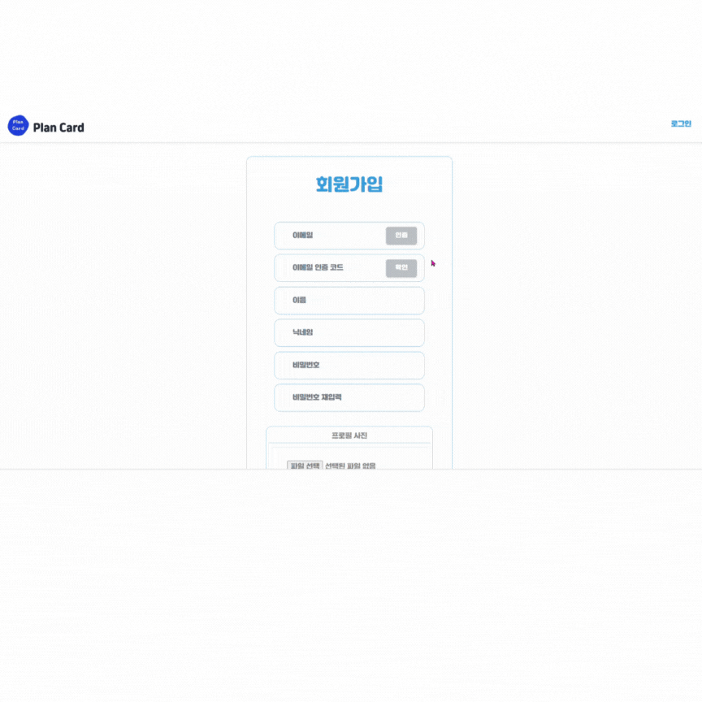
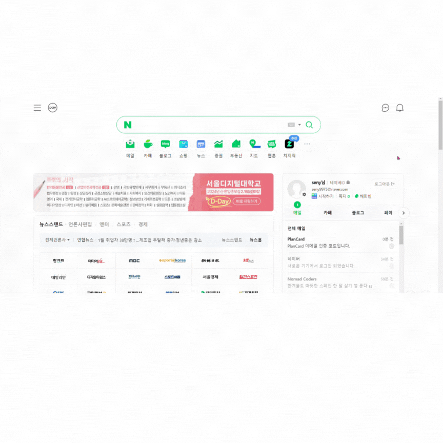
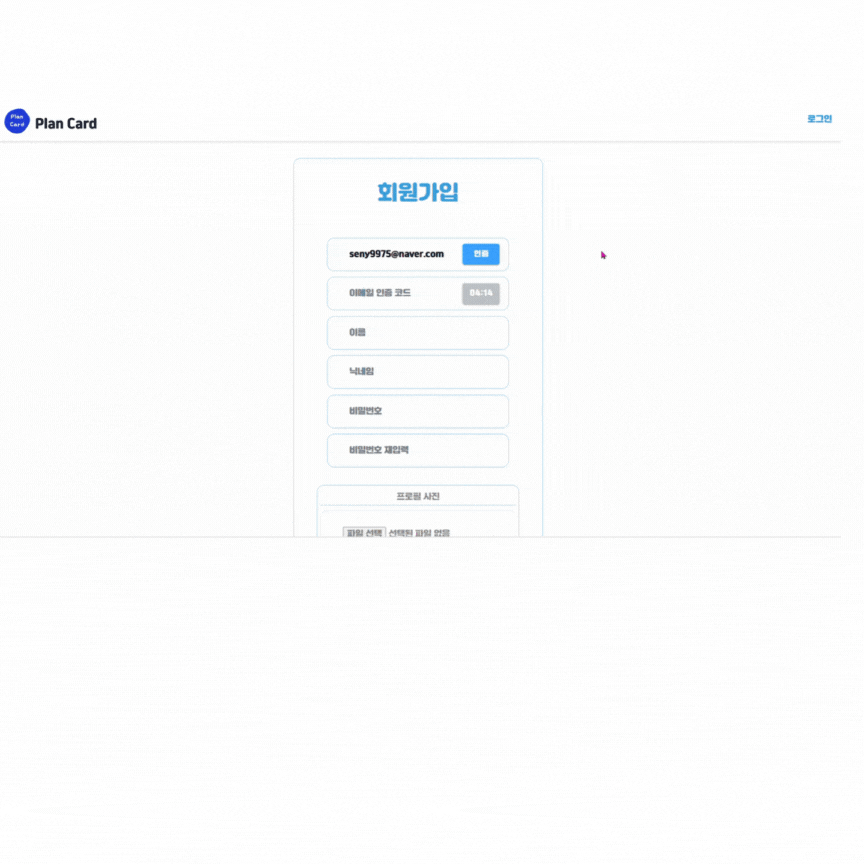

### 3. 일반 회원가입

### 4. 일반 로그인
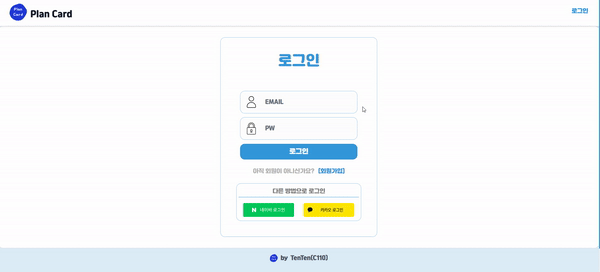

### 5. 소셜 로그인
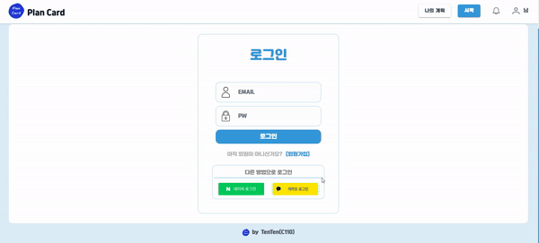

### 6. 회원 정보 불러오기
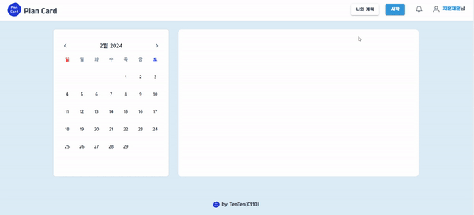

### 7. 회원 정보 수정

### 8. 비밀번호 변경
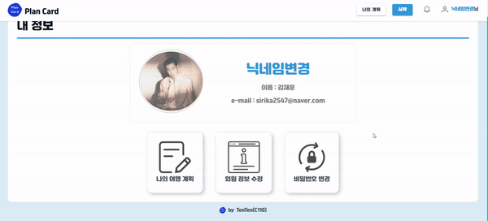

### 9. 친구 추가 보내기
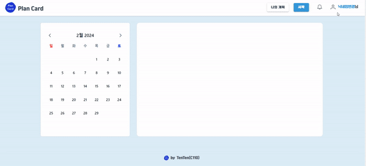

### 10. 친구 추가 요청 알림 수락
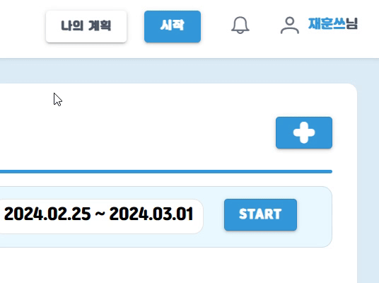

### 11. 나의 친구 내역 (친구 리스트)

### 12. 여행 계획 참여 요청 알림 수락
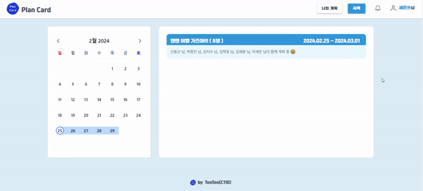

### 13. 여행 계획 만들기
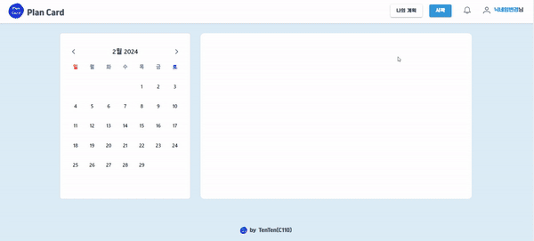

### 14. 여행 계획 참여
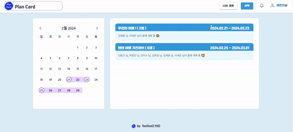

### 15. 여행 계획 관련 전체 기능 (WebSocket (Stomp) + RabbitMQ 채팅, STT (Web Speech API)를 통한 여행지 검색, 일정 선별, YJS를 이용한 카드 목록 여행 상세 계획 공동편집)

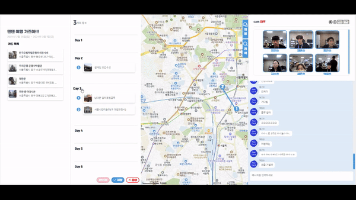

## 🛫시스템 아키텍처
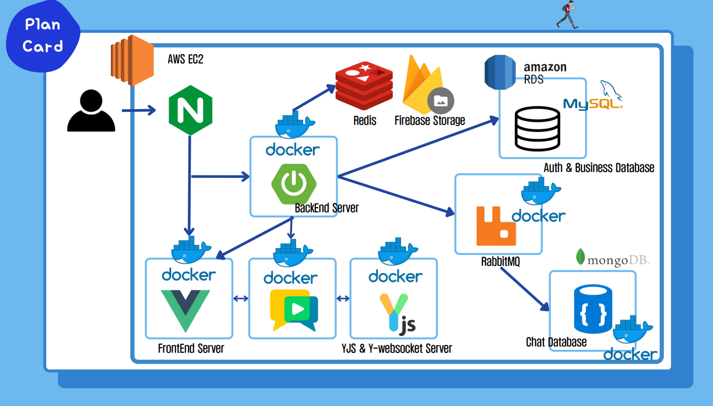

## 프로젝트 일정
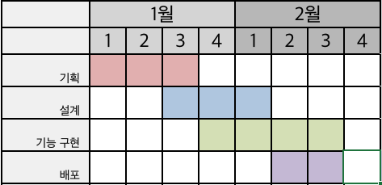

## 프로젝트 진행

### 1. Git Flow

git flow 원칙에 따라 프론트와 백을 각각 나누고 각 feature의 하위 브랜치를 사용했습니다.
각 브랜치는 
각 브랜치는 develop 브랜치에 머지했습니다.

### 2. Jira

매주 월요일 해당 주차의 할 일을 백로그에 등록 하여 진행했습니다.
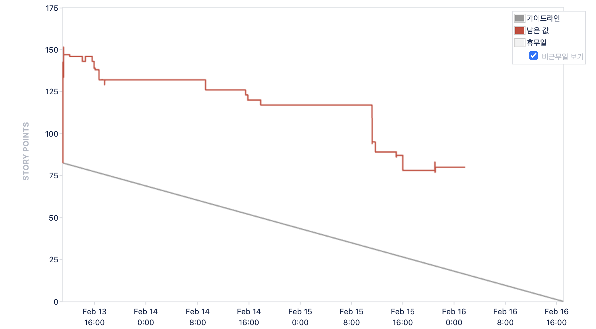

## 프로젝트 산출물

### 1. Figma
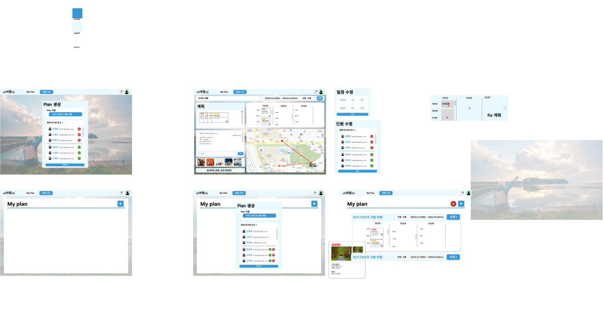

### 2. ERD
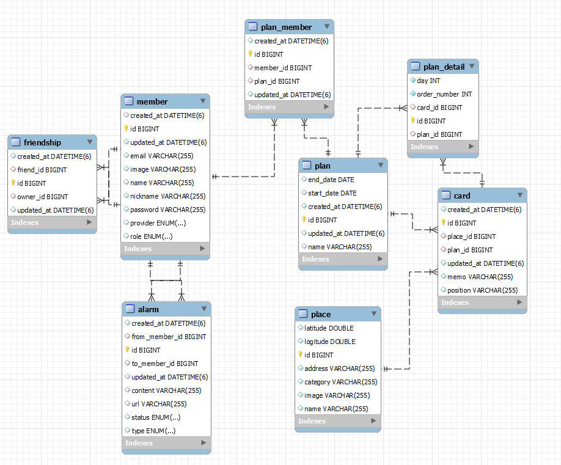

### 3. API 문서
https://translucent-polish-c76.notion.site/API-aa2371a188dc4752a3b5d7cb9d271a7b?pvs=4
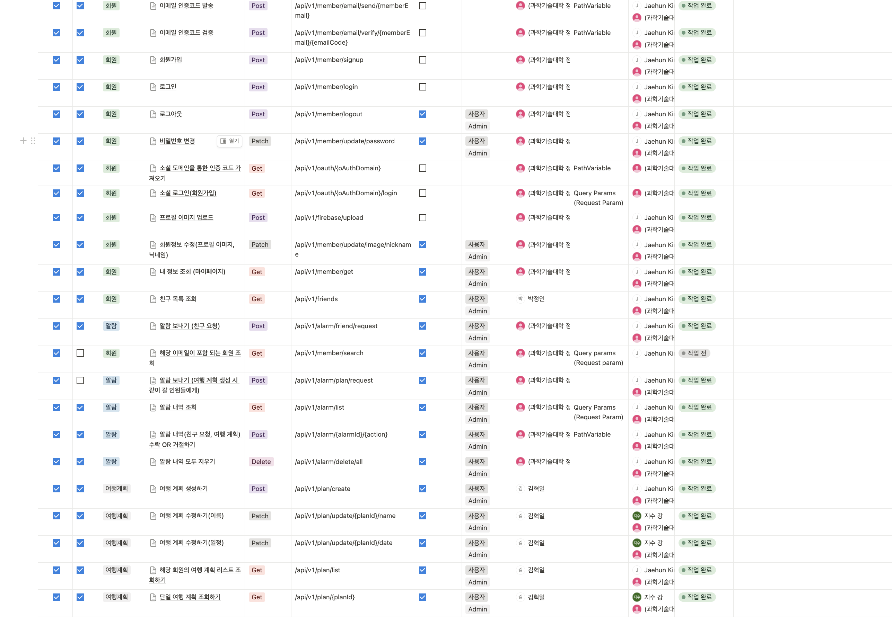
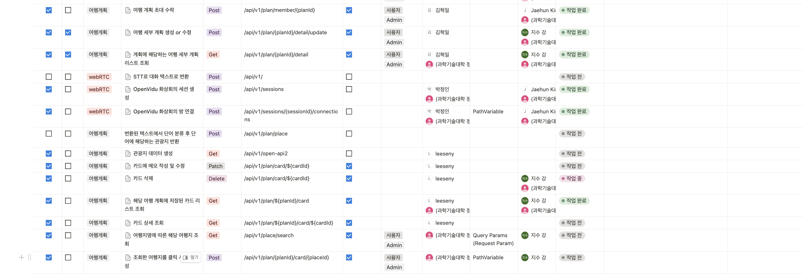

## 🛫팀원 및 역할
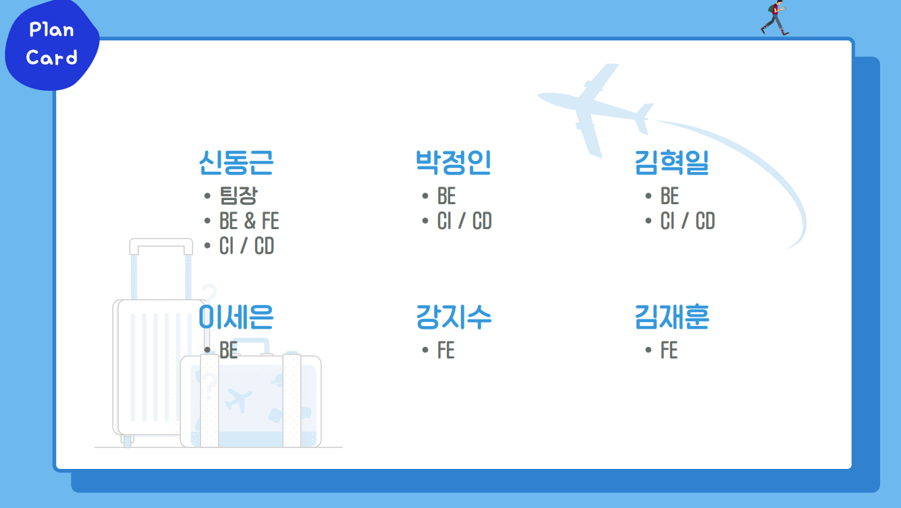
